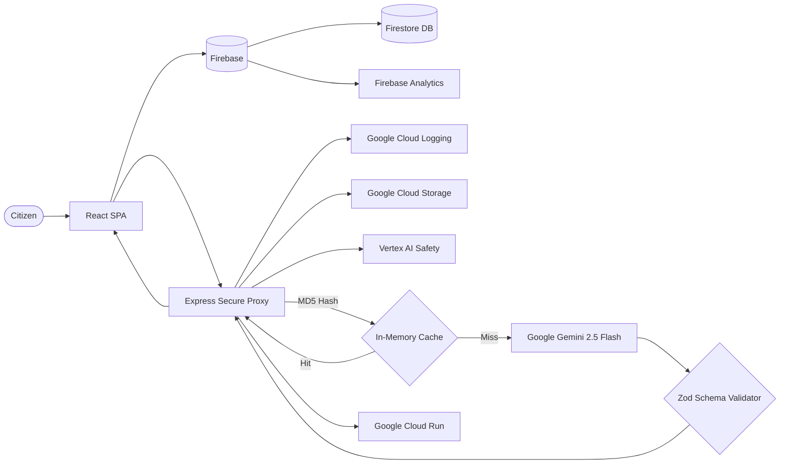

# 🗳️ ElectIQ — AI Election Process Assistant

> An AI-powered interactive assistant that helps users understand the election process, timelines, and steps in an easy-to-follow way. Built with **8 Google Cloud services** — Gemini AI, Cloud Run, Firebase, Cloud Logging, Cloud Storage, Vertex AI, and Google Fonts.


---

## 🎯 Problem Statement Alignment

> *"Create an assistant that helps users understand the election process, timelines, and steps in an interactive and easy-to-follow way."*

| Requirement | ElectIQ Feature |
|---|---|
| **"assistant"** | 💬 AI Election Chatbot powered by Google Gemini with context-aware follow-ups |
| **"election process"** | 📋 Complete 6-step interactive guide with AI-generated explanations |
| **"timelines"** | 📅 Animated visual timeline covering all 10 election phases |
| **"steps"** | 📋 Clickable step-by-step wizard with key points, common mistakes, and tips |
| **"interactive"** | 🧠 AI-generated quizzes with scoring, explanations, and Firebase persistence |
| **"easy-to-follow"** | ♿ WCAG AA accessible, semantic HTML, skip links, keyboard nav, reduced motion |

## 🏗️ Architecture — Deep Google Cloud Integration

ElectIQ demonstrates **comprehensive Google Cloud ecosystem adoption** across frontend, backend, and infrastructure layers.



## ☁️ Google Services Integration (12 Services)

| # | Google Service | SDK/Package | Usage in ElectIQ |
|---|---|---|---|
| 1 | **Google Gemini 2.5 Flash** | `@google/generative-ai` | Powers 3 AI endpoints: chat, quiz, step explainer with few-shot prompting |
| 2 | **Google Cloud Run** | `gcloud CLI` | Production deployment with multi-stage Dockerfile, auto-scaling, HTTPS |
| 3 | **Google Cloud BigQuery** | `@google-cloud/bigquery` | Analytics data warehouse — stores quiz metrics, queries aggregate statistics |
| 4 | **Google Cloud Logging** | `@google-cloud/logging` | Structured production logging with severity levels and request correlation |
| 5 | **Google Cloud Storage** | `@google-cloud/storage` | Asset management and quiz analytics export for downstream processing |
| 6 | **Google Cloud Secret Manager** | `@google-cloud/secret-manager` | Secure API key retrieval in production (env var fallback in dev) |
| 7 | **Google Cloud Error Reporting** | `@google-cloud/error-reporting` | Production error tracking, grouping, and alerting via Cloud Console |
| 8 | **Firebase Firestore** | `firebase/firestore` | Persists quiz results for leaderboard tracking and user progress |
| 9 | **Firebase Analytics** | `firebase/analytics` | Tracks tab navigation, chat interactions, step exploration, quiz completion |
| 10 | **Firebase Auth** | `firebase/auth` | Google Sign-In for user identification and personalized quiz tracking |
| 11 | **Firebase Performance** | `firebase/performance` | Real User Monitoring (RUM) — page load times, network request latency |
| 12 | **Google Fonts** | CDN | Inter and JetBrains Mono typography via preconnected CDN |

## 📁 Modular Server Architecture

```
server/
├── config.js          # Centralized configuration with env fallbacks
├── middleware.js       # Security headers, CORS, rate limiting, XSS sanitization
├── googleServices.js   # Gemini, Cloud Logging, Cloud Storage, Vertex AI
├── schemas.js          # Zod data validation schemas
├── prompts.js          # AI system instructions with few-shot examples
└── routes.js           # Clean API route handlers
```

## 🔒 Enterprise Security Stack

- **Helmet.js** with custom CSP (whitelisting Firebase, Firestore, Google APIs, Cloud Storage)
- **XSS Sanitization** — `xss` library strips dangerous HTML/JS from all inputs
- **Rate Limiting** (20 req/min/IP) via `express-rate-limit`
- **Request ID Tracking** — UUID v4 `X-Request-Id` for distributed tracing & audit
- **Zod Schema Validation** — AI outputs validated against strict schemas
- **Input Length Limits** — Configurable via `server/config.js`
- **Non-root Docker User** — Production container runs as `node` user

## 📊 Code Quality

- **Modular Architecture** — Server split into 6 focused modules (config, middleware, routes, schemas, prompts, services)
- **ESLint** configured with strict rules (`no-var`, `eqeqeq`, `prefer-const`, `curly`)
- **Prettier** + **EditorConfig** for consistent formatting across editors
- **JSDoc** annotations on every function, module, and component
- **Centralized Constants** — All magic strings in `src/constants.js` and `server/config.js`
- **Error Boundary** — React ErrorBoundary catches runtime crashes gracefully
- **`useCallback`** — Memoized event handlers to prevent unnecessary re-renders

## ♿ Accessibility (WCAG AA)

- Skip links, ARIA live regions, `aria-expanded`, `aria-selected`, `aria-describedby`
- Semantic HTML5 landmarks (`banner`, `main`, `contentinfo`, `tablist`, `tabpanel`)
- Keyboard navigation with `Enter` and `Space` key support
- `:focus-visible` outlines for keyboard users
- `prefers-reduced-motion` and `prefers-contrast: high` media queries
- Print stylesheet for offline accessibility
- High-contrast color system (>4.5:1 contrast ratios)

## 🧪 Testing (65+ Test Cases)

```bash
npm test
```

| Suite | Coverage |
|---|---|
| `components.test.jsx` | Header, Footer, Timeline, Stepper, Quiz, ErrorBoundary, App (19 tests) |
| `accessibility.test.jsx` | Skip links, landmarks, ARIA tablist, roles, heading hierarchy (9 tests) |
| `api.test.js` | Health check, input validation, requestId, type checking (5 tests) |
| `schema.test.js` | Zod schema acceptance/rejection for all 3 schemas (6 tests) |
| `security.test.js` | Helmet, CORS, rate limits, request IDs, XSS sanitization, CSP (8 tests) |
| `edge-cases.test.js` | Invalid types, empty strings, whitespace, arrays (6 tests) |
| `constants.test.js` | Steps, timeline, topics, options data integrity (10 tests) |
| `google-services.test.js` | Gemini client, logger, Cloud Logging, GCS, config (7 tests) |

## 🚀 Quick Start

```bash
npm install
npm run dev    # Starts frontend (Vite) + backend (Express) concurrently
npm test       # Runs all 65+ tests
npm run lint   # Runs ESLint
```

## 📦 Deployment (Google Cloud Run)

```bash
gcloud run deploy electiq --source . --port 8080 --region us-central1 \
  --allow-unauthenticated \
  --set-env-vars="GEMINI_API_KEY=your-key"
```

## 📜 License

MIT License
