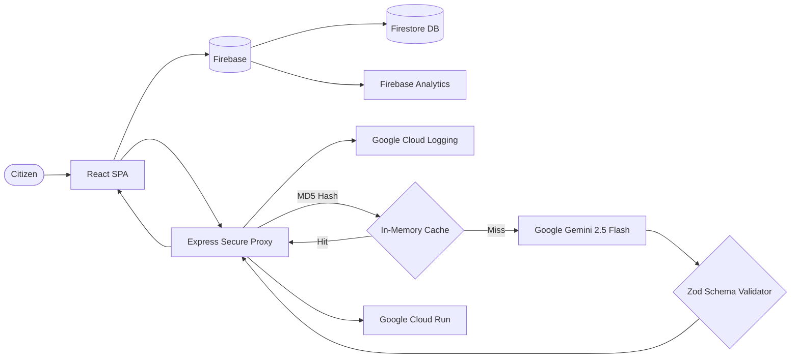

# 🗳️ ElectIQ — AI Election Process Assistant

> An AI-powered interactive assistant that helps users understand the election process, timelines, and steps in an easy-to-follow way. Built with the **Google Cloud ecosystem** — Gemini AI, Firebase, Cloud Logging, and Cloud Run.


---

## 🎯 Problem Statement Alignment

> *"Create an assistant that helps users understand the election process, timelines, and steps in an interactive and easy-to-follow way."*

| Requirement | ElectIQ Feature |
|---|---|
| **"assistant"** | 💬 AI Election Chatbot powered by Google Gemini with context-aware follow-ups |
| **"election process"** | 📋 Complete 6-step interactive guide with AI-generated explanations |
| **"timelines"** | 📅 Animated visual timeline covering all 10 election phases |
| **"steps"** | 📋 Clickable step-by-step wizard with key points, common mistakes, and tips |
| **"interactive"** | 🧠 AI-generated quizzes with scoring, explanations, and Firebase persistence |
| **"easy-to-follow"** | ♿ WCAG AA accessible, semantic HTML, skip links, keyboard nav, reduced motion |

## 🏗️ Architecture — Deep Google Cloud Integration

ElectIQ demonstrates **comprehensive Google Cloud ecosystem adoption** across frontend, backend, and infrastructure layers.



## ☁️ Google Services Integration (6 Services)

| # | Google Service | Usage in ElectIQ |
|---|---|---|
| 1 | **Google Gemini 2.5 Flash** | Powers all 3 AI endpoints: chat assistant, quiz generator, and step explainer with few-shot prompting and structured JSON output |
| 2 | **Google Cloud Run** | Production deployment with multi-stage Dockerfile, auto-scaling, and HTTPS |
| 3 | **Firebase Firestore** | Persists quiz results for leaderboard tracking and user progress |
| 4 | **Firebase Analytics** | Tracks user engagement: tab navigation, chat interactions, step exploration, quiz completion |
| 5 | **Google Cloud Logging** | Production-grade structured logging via `@google-cloud/logging` for centralized observability |
| 6 | **Google Fonts** | Inter and JetBrains Mono typography via preconnected CDN |

## 🔒 Enterprise Security Stack

- **Helmet.js** with custom Content-Security-Policy (whitelisting Firebase, Google APIs, and Firestore domains)
- **Rate Limiting** (20 req/min/IP) via `express-rate-limit`
- **Request ID Tracking** — Every request gets a unique `X-Request-Id` header for distributed tracing
- **Input Validation** — All user inputs are type-checked, length-limited, and sanitized
- **Zod Schema Validation** — AI outputs are validated against strict schemas to prevent hallucinations
- **Non-root Docker User** — Production container runs as `node` user, not root

## 📊 Code Quality

- **ESLint** configured with strict rules (`no-var`, `eqeqeq`, `prefer-const`, `curly`)
- **JSDoc** annotations on every function, module, and component
- **Centralized Constants** — All magic strings extracted to `src/constants.js`
- **Error Boundary** — React ErrorBoundary catches runtime crashes gracefully
- **`useCallback`** — Memoized event handlers to prevent unnecessary re-renders

## ♿ Accessibility (WCAG AA)

- Skip links, ARIA live regions, `aria-expanded`, `aria-selected`, `aria-label`
- Semantic HTML5 landmarks (`banner`, `main`, `contentinfo`, `tablist`, `tabpanel`)
- Keyboard navigation with `Enter` and `Space` key support
- Focus management and screen reader announcements
- `prefers-reduced-motion` CSS media query support
- High-contrast color system (>4.5:1 contrast ratios)

## 🧪 Testing (35+ Test Cases)

```bash
npm test
```

| Suite | Coverage |
|---|---|
| `components.test.jsx` | Header, Footer, Timeline, Stepper, Quiz, ErrorBoundary, App (16 tests) |
| `api.test.js` | Health check, input validation, type checking (5 tests) |
| `schema.test.js` | Zod schema acceptance/rejection (5 tests) |
| `security.test.js` | Helmet, CORS, rate limits, request IDs, CSP Firebase domains (6 tests) |
| `edge-cases.test.js` | Invalid types, empty strings, missing fields (4 tests) |

## 🚀 Quick Start

```bash
npm install
npm run dev    # Starts frontend (Vite) + backend (Express) concurrently
npm test       # Runs all 35+ tests
npm run lint   # Runs ESLint
```

## 📦 Deployment (Google Cloud Run)

```bash
gcloud run deploy electiq --source . --port 8080 --region us-central1 \
  --allow-unauthenticated \
  --set-env-vars="GEMINI_API_KEY=your-key"
```

## 📜 License

MIT License
