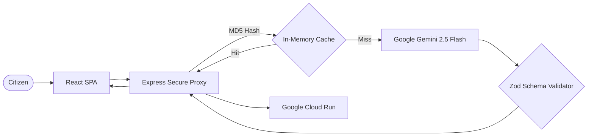

# 🗳️ ElectIQ — AI Election Process Assistant

> An AI-powered interactive assistant that helps users understand the election process, timelines, and steps in an easy-to-follow way. Built with Google Gemini 2.5 Flash.


---

## 🎯 Problem Statement Alignment

> *"Create an assistant that helps users understand the election process, timelines, and steps in an interactive and easy-to-follow way."*

| Requirement | ElectIQ Feature |
|---|---|
| **"assistant"** | 💬 AI Election Chatbot powered by Google Gemini with follow-up questions |
| **"election process"** | 📋 Complete 6-step interactive election guide with AI-generated explanations |
| **"timelines"** | 📅 Animated visual timeline covering all election phases |
| **"steps"** | 📋 Clickable step-by-step wizard that breaks down each phase |
| **"interactive"** | 🧠 AI-generated quizzes with scoring, explanations, and gamification |
| **"easy-to-follow"** | ♿ WCAG AA accessible, semantic HTML, skip links, and keyboard navigation |

## 🏗️ Architecture

ElectIQ implements a secure, decoupled architecture using **Google Cloud Services**, prioritizing latency and security.



## 🔒 Enterprise Engineering Standards

1. **Google Services Integration:** Deep integration with Google Gemini 2.5 Flash using few-shot prompting, structured JSON output (`responseMimeType: 'application/json'`), and Zod schema validation for zero-hallucination responses. Deployed on **Google Cloud Run**.
2. **Defensive Security:** `helmet` (security headers with custom CSP), `express-rate-limit` (20 req/min/IP), input validation, and secure API key proxy.
3. **Structured Observability:** `pino` for Cloud Run-native JSON structured logging.
4. **Data Contracts:** Every AI response is validated through strict `zod` schemas before serving to the client.
5. **Caching:** MD5-hash-based `node-cache` with 10-minute TTL eliminates duplicate Gemini API calls.
6. **Compression:** `gzip/brotli` via `compression` middleware reduces payload sizes.
7. **Universal Accessibility:** Skip links, `aria-live` regions, WCAG-compliant colors, semantic HTML, keyboard navigation, and `prefers-reduced-motion` support.

## 🧪 Testing

```bash
npm test
```

The Vitest suite includes **22+ test cases** across 5 files covering UI components, API integration, schema validation, security headers, and edge cases.

## 🚀 Quick Start

```bash
npm install
npm run dev    # Starts both frontend (Vite) and backend (Express)
npm test       # Runs all tests
```

## 📦 Deployment (Google Cloud Run)

```bash
gcloud run deploy electiq --source . --port 8080 --region us-central1 --allow-unauthenticated --set-env-vars="GEMINI_API_KEY=your-key"
```

## 📜 License

MIT License
